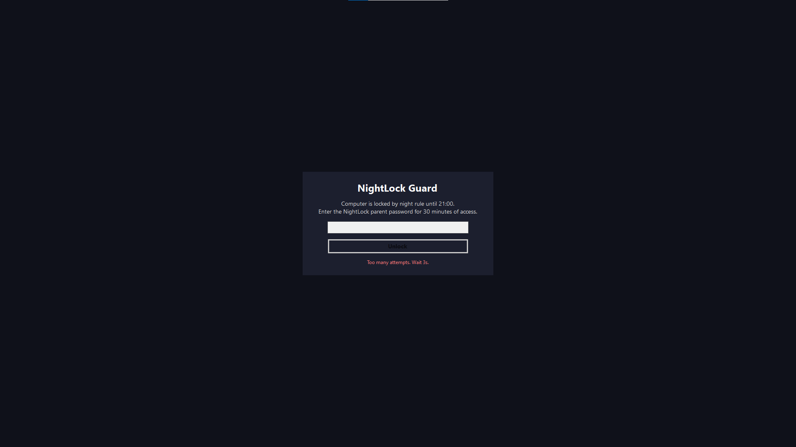
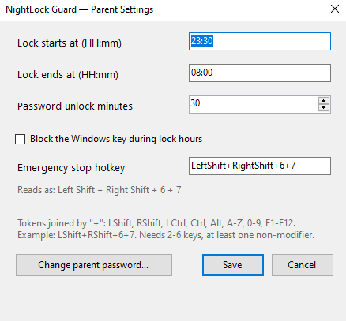

# NightLock Guard

> A small, transparent Windows parental-control tool: it locks the computer during the hours you
> choose, and only a parent password lets it back in.

Windows-only parental-control utility that locks the computer during a daily time window **the
parent picks in the settings panel** (a sensible default is provided, and you can change the start
and end time, the password-unlock duration, and more). During that window it shows a full-screen
lock with a warning shortly before; the only way past it is the **NightLock parent password**, which
grants a temporary, configurable period of access before the lock returns.

It is **best-effort, transparent** software for a parent's own family PC — not spyware. It does not
monitor activity, log keystrokes, record the screen, or touch the Windows account password. See
[Responsible use](#responsible-use).

The behaviour is defined up front in the specs under [`specs/`](specs/), and the C# carries
`@spec` markers back to them.

## Screenshots

<p align="center">
  <br>
  <em>The full-screen night lock — only the parent password gets past it.</em>
</p>

<p align="center">
  <br>
  <em>Repeated wrong passwords are rate-limited.</em>
</p>

<p align="center">
  <br>
  <em>Hidden, password-gated settings panel (tray → Settings…).</em>
</p>

## How it works

- **Service** (`NightLock.Service`) starts with Windows, evaluates the schedule for logging, and
  relaunches the session helper if it is killed during restricted hours.
- **Session helper** (`NightLock.Helper`) runs in the logged-on user's session and shows the warning
  and the full-screen lock window, verifies the parent password, blocks the Windows key during lock
  hours, and listens for the emergency stop hotkey.
- **Parent settings panel** (`NightLock.Admin`) is a hidden, password-gated app for changing the
  schedule, override minutes, Windows-key blocking, the stop hotkey, and the password. It is not in
  the Start menu / Windows search — open it from the helper's tray icon (**Settings…**). It runs
  elevated so it can write the protected config.
- **CLI** (`NightLock.Cli`) sets the parent password, override duration, Windows-key blocking, and
  the stop hotkey.
- **Core** (`NightLock.Core`) holds the schedule policy, PBKDF2 password verifier, and hotkey model.

## Extra controls

- **Block the Windows key** while the lock is showing, so the child can't open the Start menu or
  escape the lock (only during restricted hours; on by default).
- **Emergency stop hotkey** — holding **Left Shift + Right Shift + 6 + 7** together stops enforcement
  for the rest of the session (until the next logon/reboot). The combo is configurable in the
  settings panel so you can pick one the child won't guess. It is a convenience secret, not a
  password — see `specs/TECHDEBT.md` (TD-005).

- **Works in Safe Mode too** — the service and the Task Scheduler that launches the helper are
  registered to start under Safe Mode, so the lock can't be skipped by booting into Safe Mode. (As a
  side effect, recovering the machine via Safe Mode also needs the parent password or the stop combo
  — see `specs/TECHDEBT.md` TD-007.)

These rely on a single narrow keyboard hook that only blocks specific keys and detects the stop
combo; it never records what you type.

The parent password is stored only as a salted PBKDF2 verifier in
`C:\ProgramData\NightLockGuard\config.json` (never in plaintext, never the Windows password). The
override is held in memory by the helper, so killing the helper does not grant access.

This is **best-effort** protection against casual late-night use, not a tamper-proof secure desktop.
See [`specs/TECHDEBT.md`](specs/TECHDEBT.md) for the accepted limitations.

## Responsible use

NightLock Guard is meant for a **parent or guardian to install on a computer they own**, to limit
their own child's late-night use. It is deliberately transparent:

- it installs to ordinary locations (`C:\Program Files\NightLockGuard`,
  `C:\ProgramData\NightLockGuard`) and does not hide or disguise itself as a system process;
- it does **not** monitor activity, capture keystrokes, record the screen, or read/store the Windows
  account password;
- the single keyboard hook it uses only blocks specific keys (the Windows key during lock hours) and
  detects the stop combo — it never records what you type;
- it is best-effort against casual misuse, not a secure desktop; a determined administrator can stop
  it (see [`specs/TECHDEBT.md`](specs/TECHDEBT.md)).

Please don't use it to restrict another adult's computer without their knowledge.

## Install on Windows

### Easiest: the Setup.exe (recommended)

Download **`NightLockGuard-Setup.exe`** from the [Releases](../../releases) page, double-click it, and
follow the wizard: it asks for the **parent password** and the **lock schedule**, then installs
everything (no PowerShell, no .NET SDK, no building from source). Requires administrator approval
(UAC), like any installer.

> Building the installer yourself: on a Windows machine with the .NET 8 SDK, run
> `.\scripts\build-installer.ps1` — it publishes the apps and produces `dist\NightLockGuard-Setup.exe`
> (installing Inno Setup via `winget` if needed).

### From source (PowerShell)

Alternatively, on a **Windows** PC open PowerShell **as Administrator** in the project folder and run:

```powershell
.\scripts\install.ps1
```

The installer will:

1. install the .NET 8 SDK via `winget` if it is not already present;
2. publish the apps (self-contained, so no separate runtime is needed) into `C:\Program Files\NightLockGuard`;
3. prompt you for the parent password;
4. set the override duration (default 30 minutes — use `-OverrideMinutes 60` to change it);
5. harden permissions on `C:\ProgramData\NightLockGuard`;
6. create the `NightLockGuard` service and a logon task that runs the helper for interactive users.

To change the password or override later:

```powershell
& "C:\Program Files\NightLockGuard\NightLock.Cli.exe" set-password --password "newSecret"
& "C:\Program Files\NightLockGuard\NightLock.Cli.exe" set-override --minutes 45
& "C:\Program Files\NightLockGuard\NightLock.Cli.exe" set-winkey --off
& "C:\Program Files\NightLockGuard\NightLock.Cli.exe" set-hotkey --keys "LShift+RShift+6+7"
& "C:\Program Files\NightLockGuard\NightLock.Cli.exe" status
```

## Build / test from source (developer machine with the .NET SDK)

```powershell
dotnet build .\NightLockGuard.sln -c Release
dotnet run --project .\tests\NightLock.Core.Tests
```

## Uninstall on Windows

Run PowerShell as Administrator:

```powershell
.\scripts\uninstall.ps1
```

Use `-RemoveData` to also delete `C:\ProgramData\NightLockGuard`.

## Architecture & design

This repo is also a demonstration of a **spec-driven workflow**: every feature is written as a
canonical spec first (`specs/modules/core/*`), the operational state lives in
[`specs/BOARD.md`](specs/BOARD.md) and [`specs/WAL.md`](specs/WAL.md), and the C# carries
`@spec spec://…#anchor` markers back to the governing spec. The runtime is split into a background
**service**, a session **helper** (all visible enforcement), a hidden **admin panel**, a **CLI**,
and a small **core** library covered by unit tests.

```
src/
  NightLock.Core      schedule policy, PBKDF2 verifier, hotkey model (+ tests)
  NightLock.Service   Windows service: schedule logging + helper supervision
  NightLock.Helper    session app: warning, lock window, Win-key/stop-combo hook
  NightLock.Admin     hidden, password-gated settings panel
  NightLock.Cli       configure password / schedule / override / Win-key / hotkey
specs/                canonical behaviour, roadmap, accepted tech-debt
scripts/              install.ps1 / uninstall.ps1
```

## License

Released under the [MIT License](LICENSE) © 2026 k1lumiyoung.
